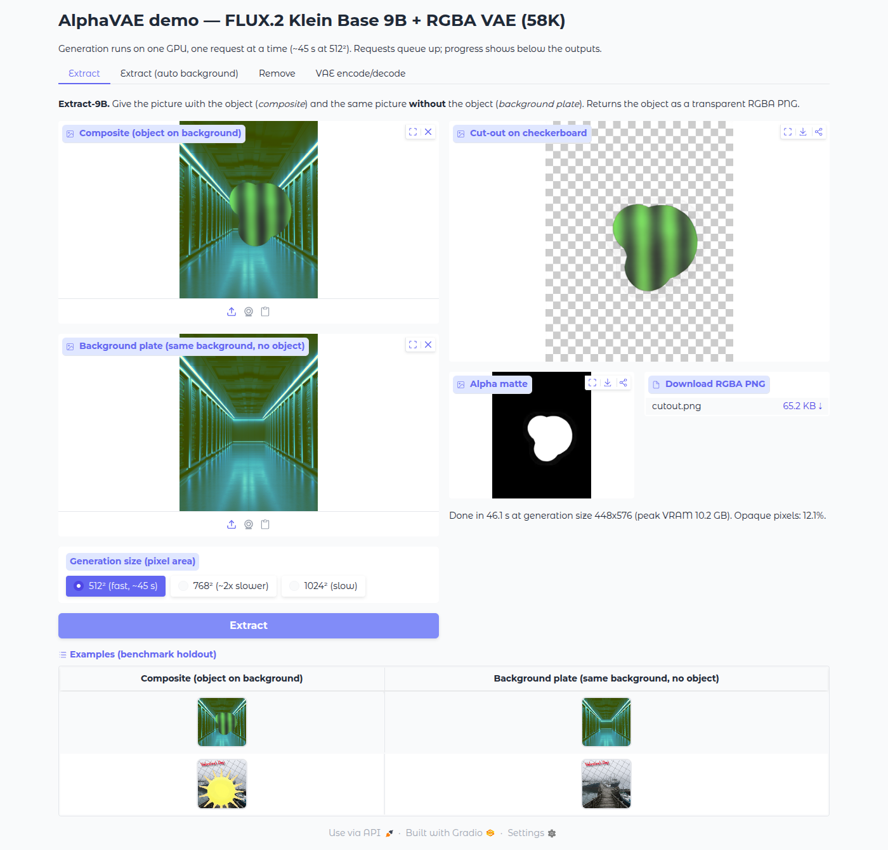
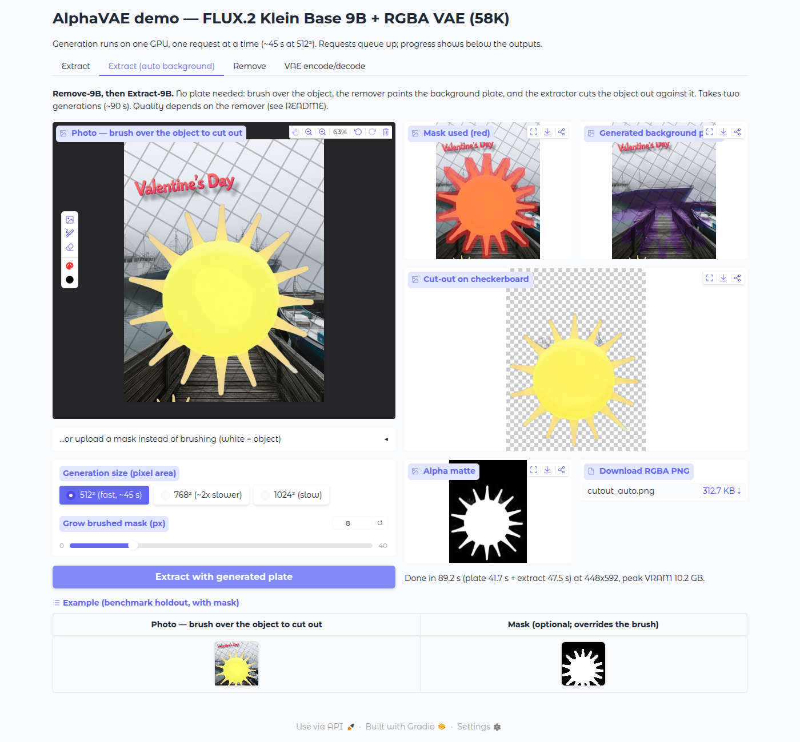
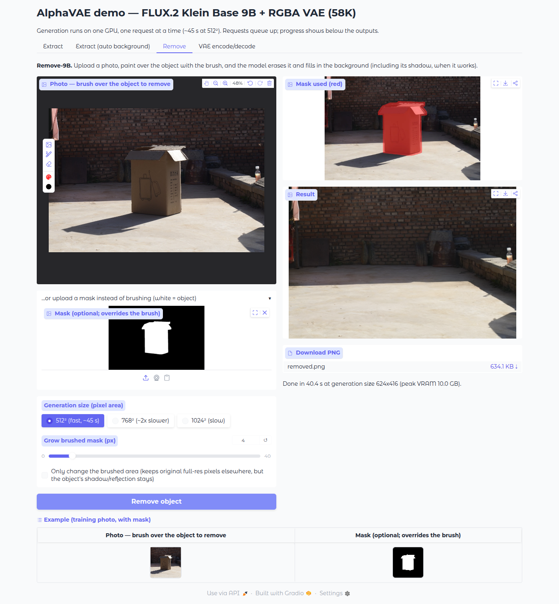
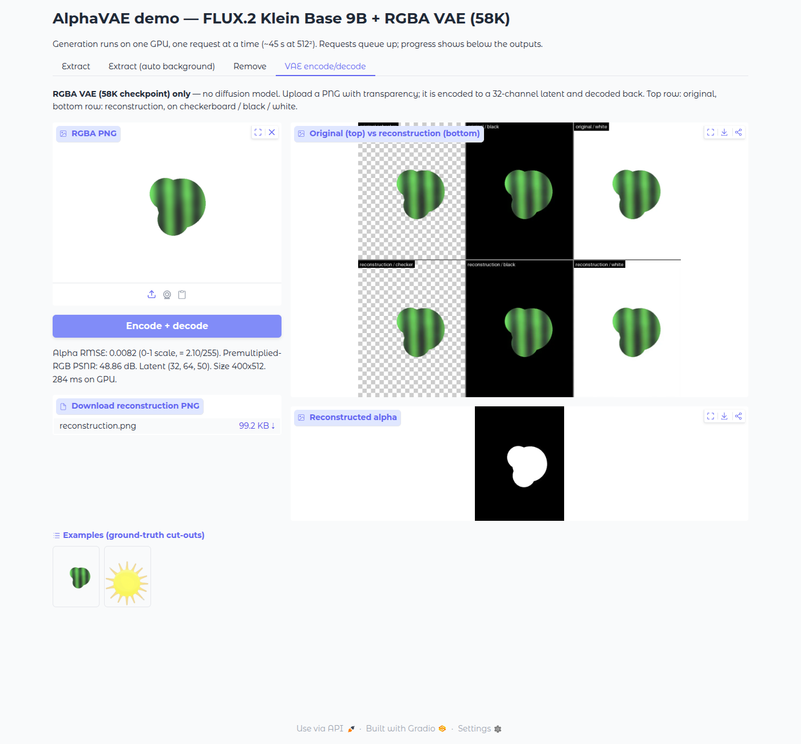

# FLUX.2 Klein Alpha

This repository contains an RGBA (four-channel) VAE for FLUX.2 Klein, plus two LoRAs for FLUX.2 Klein Base 9B that use it. **Extract-9B** cuts an object out of a picture as a transparent PNG. **Remove-9B** erases an object from a photo and fills in the background. The RGBA VAE follows the method and loss of [AlphaVAE (Wang et al., 2025)](https://arxiv.org/abs/2507.09308). I trained the LoRAs with [ostris/ai-toolkit](https://github.com/ostris/ai-toolkit) (MIT), with the changes in [`ai-toolkit-rgba/`](ai-toolkit-rgba/). The repo contains a Gradio demo for all of this and the ai-toolkit patch. The weights are hosted on Hugging Face.

Author: Xavier Jara

| Extract | Extract (auto background) |
|---|---|
|  |  |
| **Remove** | **VAE encode/decode** |
|  |  |

On the anime holdout example, Extract-9B at 512² gives a cut-out whose alpha mask has an IoU of 0.988 with the ground truth. The VAE reconstructs that example's alpha with an RMSE of 2.4/255.

## Get the weights

The weights are in the Hugging Face repo [`trmz/flux2-klein-alpha`](https://huggingface.co/trmz/flux2-klein-alpha):

```
trmz/flux2-klein-alpha
├── vae/
│   ├── config.json                          # RGBA VAE (diffusers AutoencoderKLFlux2, 58K-step checkpoint)
│   └── diffusion_pytorch_model.safetensors
└── loras/
    ├── extract_9b.safetensors               # Extract-9B LoRA (FLUX.2 Klein Base 9B)
    └── remove_9b.safetensors                # Remove-9B LoRA (FLUX.2 Klein Base 9B)
```

You don't have to download anything by hand. On first use the demo fetches these files into the Hugging Face cache. To keep a local copy instead:

```bash
huggingface-cli download trmz/flux2-klein-alpha --local-dir weights
# then point the demo at it:
export VAE_PATH=$PWD/weights/vae
export EXTRACT_LORA=$PWD/weights/loras/extract_9b.safetensors
export REMOVE_LORA=$PWD/weights/loras/remove_9b.safetensors
```

The base model is [`black-forest-labs/FLUX.2-klein-base-9B`](https://huggingface.co/black-forest-labs/FLUX.2-klein-base-9B). It is gated, so first accept its licence on its Hugging Face page and log in with `huggingface-cli login`. The demo downloads it on first start, which takes a while.

### Licence of the weights

These weights are for **research and non-commercial use only**.

- **VAE:** my RGBA VAE was fine-tuned from the FLUX.2-dev VAE, modified for four-channel input and output. FLUX.2-dev is released under the [FLUX Non-Commercial License](https://huggingface.co/black-forest-labs/FLUX.2-dev/blob/main/LICENSE.md), so the VAE is too.
- **LoRAs:** both LoRAs were trained on FLUX.2 Klein Base 9B, which is also under the FLUX Non-Commercial License.
- The licence rights come from Black Forest Labs, not from me. This is an independent experiment, not a Black Forest Labs product, and the weights come with no warranty.

The required attribution notice for these weights:

> This FLUX Model is licensed by Black Forest Labs Inc. under the FLUX Non-Commercial License. Copyright Black Forest Labs Inc. IN NO EVENT SHALL BLACK FOREST LABS INC. BE LIABLE FOR ANY CLAIM, DAMAGES OR OTHER LIABILITY, WHETHER IN AN ACTION OF CONTRACT, TORT OR OTHERWISE, ARISING FROM, OUT OF OR IN CONNECTION WITH USE OF THIS MODEL.

Klein Base **4B** is listed as Apache 2.0. That does not apply here: these weights come from FLUX.2-dev and Klein Base 9B.

## Quick start

You need Linux, Python 3.10+ and one NVIDIA GPU with about **12 GB of VRAM**. The demo runs the 9B transformer and text encoder quantized to fp8 (qfloat8), as during training. Each image takes about **45 s at 512²** (measured on a 16 GB card).

```bash
# 1. this repo, and ai-toolkit at the upstream commit the patch is made against, with my changes applied
git clone https://github.com/TR-MZ/flux2-klein-alpha.git
git clone https://github.com/ostris/ai-toolkit.git
cd ai-toolkit
git checkout e03c6e4
git apply ../flux2-klein-alpha/ai-toolkit-rgba/ai-toolkit-rgba.patch
cp -r ../flux2-klein-alpha/ai-toolkit-rgba/new_files/. .

# 2. ai-toolkit's environment, plus the demo's extra packages
python -m venv venv && source venv/bin/activate
# install PyTorch first, exactly as ai-toolkit's README says (it pins the versions and the CUDA wheel index)
pip install -r requirements.txt
pip install -r ../flux2-klein-alpha/demo/requirements.txt
huggingface-cli login            # needed for the gated FLUX.2 Klein Base 9B
cd ..

# 3. run the demo
export AITK_PATH=$PWD/ai-toolkit
PYTHON=$AITK_PATH/venv/bin/python flux2-klein-alpha/demo/run.sh
```

These commands assume `flux2-klein-alpha` (this repo) and `ai-toolkit` are side by side. Then open http://127.0.0.1:7860.

- If `AITK_PATH` is not set, the demo looks for `ai-toolkit/` inside this repo and then next to it.
- The 9B model loads once at startup, which takes about 80 s once it is downloaded. The VAE tab works during loading, and generation requests wait until loading finishes.
- `run.sh` uses GPU 0 unless you set `CUDA_VISIBLE_DEVICES`. The demo listens on `127.0.0.1` by default. To reach it from other machines, run `run.sh --host 0.0.0.0 --port 7860`. The demo has no authentication, so only do this on a network you trust.
- `PRELOAD_9B=0` loads the 9B on the first generation request instead of at startup.
- `run.sh --check-weights` only resolves or downloads the four weight files and prints their paths. It needs no GPU and no ai-toolkit.
- One generation runs at a time. Other requests wait in a queue, and a progress bar shows the current step.

## What each tab does

**Extract** (Extract-9B). This tab cuts an object out as a transparent PNG.
- *Composite*: the picture with the object in it.
- *Background plate*: the **same picture without the object**, with the same framing and size. The model compares the two images to decide what the object is, so the plate must match the composite everywhere except where the object is.
- Output: the object as an RGBA PNG. The demo shows it on a checkerboard next to its alpha matte, with a download button.

**Extract (auto background)** (Remove-9B, then Extract-9B). Use this tab when you don't have a background plate.
- Upload the photo and paint over the object with the red **brush**. The brush only marks which object you mean, so rough strokes are fine. Covering a little too much is better than too little.
- Instead of brushing, you can upload a black-and-white mask (white = object) under "…or upload a mask".
- Remove-9B paints a background plate, and then Extract-9B cuts the object out against that plate. The demo shows the mask it used, the generated plate and the cut-out. Each request takes about 90 s because it runs two generations.

**Remove** (Remove-9B). Upload a photo, brush over the object (or upload a mask), and the model erases the object and fills in the background.
- By default the demo returns the model's whole output, so the object's shadow can be removed too. The model works at about 512² and the demo upscales its output to the photo's size.
- Tick "Only change the brushed area" to keep the original full-resolution pixels outside the brushed area. With that option the object's shadow stays.

**VAE encode/decode** (the RGBA VAE only, no diffusion model).
- Upload a PNG with transparency. The VAE encodes it to a 32-channel latent and decodes it back.
- Output: the original and the reconstruction on checkerboard, black and white backgrounds, plus the alpha RMSE and premultiplied-RGB PSNR. This takes under a second. Images larger than 1536 px are downscaled first.

**Generation size** sets the pixel area the model works at. 512² matches the size the models were sampled at during training, and it is the fastest.

## Known limitations

- Remove-9B was trained on real photos (the OBER dataset from ObjectClear), and it works well on photos. On synthetic or graphic images it removes the object but often fills the hole with odd content. On the anime holdout example it left a purple smear. The auto-background extraction still gave a clean cut-out on that example (IoU 0.987, against 0.988 with the true plate). Still, check the generated plate.
- Extract-9B needs a plate that matches the composite pixel for pixel outside the object. A plate from a different photo, or one that is shifted or rescaled, will give a poor cut-out.
- I have only tested the 512² generation size. The 768² and 1024² options are slower, and I have not tested them.
- The brush in Gradio's image editor needs WebGL. If the editor looks blank, use a browser with hardware acceleration, or upload a mask instead.
- Very wide or tall images are padded to at most 4:1, because FLUX.2's reference encoder rejects more extreme aspect ratios.
- The screenshots come from an earlier build of the demo, so their page title differs.

## Example images

The images in `demo/examples/` come from my training and evaluation data. **Their licences still need review before this repository is made public.**

| File | Where it comes from |
|---|---|
| `extract_watercolor_{composite,plate,groundtruth}.png` | A holdout benchmark item (`fg_opaque_v2_holdout/0002_watercolor_painting_00018`). I generated the object procedurally. The background is from my environment pool, recorded as `Pokemon_00030_layer_09.png`, a layer from the PrismLayers dataset. |
| `extract_anime_{composite,plate,groundtruth}.png` | A holdout benchmark item (`remover_mixed_v1_holdout/hard_0004_anime_00507`). The object is a PrismLayers layer (`anime_00507_layer_06.png`). The background is from my environment pool, recorded as a purepng.com download, with procedural grid and distractor overlays added. |
| `auto_anime_mask.png` | A mask I made from the anime item's ground-truth alpha, grown by about 6 px. |
| `remove_photo.png`, `remove_mask.png` | A training item from the OBER dataset (ObjectClear), `cutout/00000_0001`. The photo is its RGB, and the mask is its object region grown by 6 px. |

## Credits

- **AlphaVAE**: Wang et al., 2025, [arXiv:2507.09308](https://arxiv.org/abs/2507.09308), [code](https://github.com/o0o0o00o0/AlphaVAE). The RGBA VAE follows its method and loss.
- **ai-toolkit** by Ostris ([github.com/ostris/ai-toolkit](https://github.com/ostris/ai-toolkit), MIT License, © 2024 Ostris, LLC). I used it for training and use it for the demo's inference. `ai-toolkit-rgba/` contains my changes.
- **FLUX.2** by Black Forest Labs: the FLUX.2-dev VAE and FLUX.2 Klein Base 9B.
- [LayerDiffuse](https://github.com/lllyasviel/LayerDiffuse) and its [FLUX.1 adaptation](https://github.com/FireRedTeam/LayerDiffuse-Flux) inspired the separate VAE-plus-LoRA approach. No code or weights from them are included.
- Training data: PrismLayers, and the OBER dataset from ObjectClear.

## Licence

The licence for the code in this repository is to be decided. The ai-toolkit patch modifies MIT-licensed code, and the weights on Hugging Face are under the FLUX Non-Commercial License (see above).
